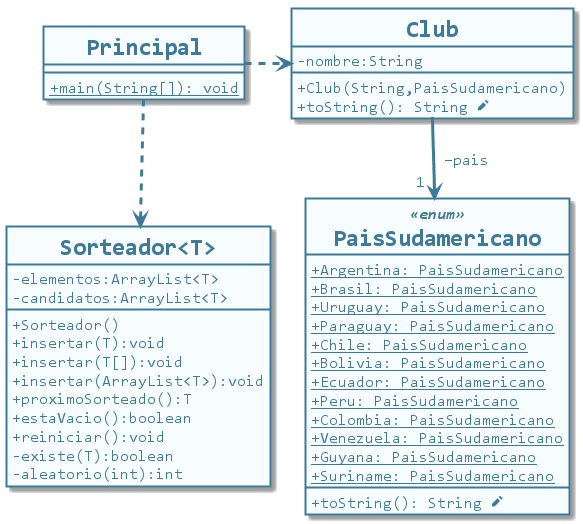

# Generics en Java

## Descripción

Ejemplo de funcionamiento de la genericidad de tipos en Java.
Se crea una colección propia llamada `Sorteador` la cual permite guardar elementos de cualquier tipo y obtenerlos de forma aleatoria.

## Diagrama de clases

Proyecto realizado con Eclipse IDE.